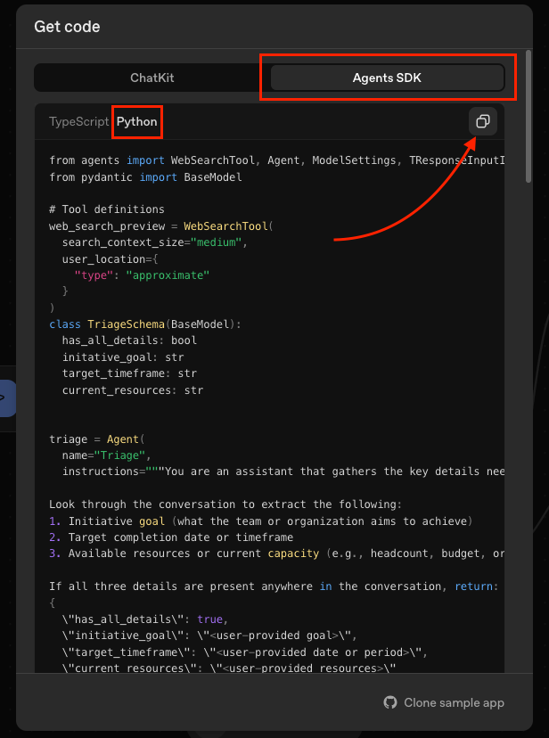

# Telegram OpenAI AgentKit

[](https://opensource.org/licenses/Apache-2.0)
[](https://www.python.org/downloads/)
[](https://python-poetry.org/)
[](https://github.com/psf/black)
[](https://www.docker.com/)
[](https://platform.openai.com/)
[](https://t.me/hschickdevs)

A lightweight Telegram bot wrapper that enables Telegram users to chat directly with [AgentKit-powered AI agents](https://openai.com/index/introducing-agentkit/) — **upload**, **switch**, and **interact** with workflows seamlessly **through a simple Telegram interface**.


### Features:

- 🤖 **Direct Workflow Integration** - Upload Agent Builder exported workflows and chat with them via Telegram
- 🔄 **Multi-Workflow Support** - Register and switch between multiple workflows per user
- 📤 **Easy Updates** - Update existing workflows with new versions using `/update`
- 💬 **Conversation Sessions** - Maintains conversation history using OpenAI Agents SDK
- 🔒 **Per-User Isolation** - Each user has their own workflows and sessions
- 📦 **Zero Config** - Just upload your exported Python files - no code changes needed
- ⚡ **Built on Latest Tech** - Uses `python-telegram-bot` 21.x and `openai-agents` SDK

---

### Table of Contents
- [Quick Start](#quick-start)
    - [Prerequisites](#prerequisites)
    - [Setup](#setup)
- [Usage](#usage)
    - [Create & Upload a Workflow](#create--upload-a-workflow)
- [Development](#development)
    - [Running in Docker](#running-in-docker)
    - [Code Quality Tools](#code-quality-tools)
        - [Formatting with Black](#formatting-with-black)
        - [Linting with Ruff](#linting-with-ruff)
        - [Type Checking with Mypy](#type-checking-with-mypy)
        - [Development Workflow](#development-workflow)
- [License & Contact](#license--contact)

## Quick Start

### Prerequisites
- Python >=3.12 (version specified in [.tool-versions](.tool-versions) recommended)
- Poetry ([installation guide](https://python-poetry.org/docs/#installation))

### Setup

```bash
# Clone the repository
git clone https://github.com/hschickdevs/telegram-openai-agentkit.git
cd telegram-openai-agentkit

# Install dependencies with Poetry
poetry install

# Configure environment variables
cp .env.example .env
# Edit .env and add your OPENAI_API_KEY and TELEGRAM_BOT_TOKEN

# Run the bot
poetry run python -m src
```

## Usage

After starting the bot, see existing commands with `/help`.

### Create & Upload a Workflow:

1. Create a new workflow in the [OpenAI Agent Builder](https://platform.openai.com/agent-builder) tool.

    > Make sure to create an **End** node in your workflow, otherwise the responses will be empty. 

2. Once finished, click the **Code** button -> **Agents SDK** -> and copy the code snippet as **Python**:

    

3. Save the code snippet as a `.py` or `.txt` file on your local machine (e.g., `my_workflow.py` or `my_workflow.txt`).

4. Use `/upload` in Telegram and send the file when prompted.

5. Give your workflow a name when prompted.

6. Once the workflow is registered, you can activate it with `/activate <workflow_name>`.

Chat normally after activating a workflow - it just works! 🚀

## Development

### Running in Docker

> Ensure that you have set your environment variables in a `.env` file ([see above](#quick-start)).

```bash
docker compose up -d
```

### Code Quality Tools

This project uses several tools to maintain code quality:

#### Formatting with Black
```bash
# Format all Python files
poetry run black .

# Check formatting without making changes
poetry run black --check .
```

#### Linting with Ruff
```bash
# Run linter on all files
poetry run ruff check .

# Auto-fix issues where possible
poetry run ruff check --fix .

# Watch mode for development
poetry run ruff check --watch .
```

#### Type Checking with Mypy
```bash
# Run type checker
poetry run mypy src/

# Check specific file
poetry run mypy src/bot/app.py
```

### Development Workflow

```bash
# Install all dependencies (including dev)
poetry install

# Run all quality checks before committing
poetry run black .
poetry run ruff check --fix .
poetry run mypy src/
```

## License & Contact

This project is licensed under the [Apache License 2.0](LICENSE) (open-source, free for personal and commercial use).

Reach out to me on [Telegram](https://t.me/hschickdevs) if you have any questions or feedback!

**Built with ❤️ for the [OpenAI AgentKit](https://platform.openai.com/docs/guides/agents) community**
